# Mermaid 组合验收

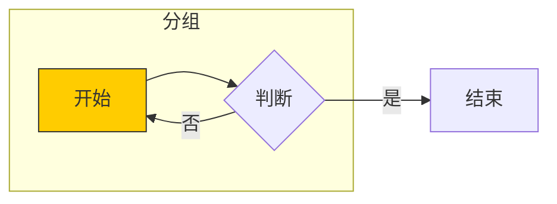
```mermaid
flowchart LR
subgraph group[分组]
A[开始] --> B{判断}
end
B -->|是| C[结束]
B -->|否| A
style A fill:#ffcc00,stroke:#333333
```

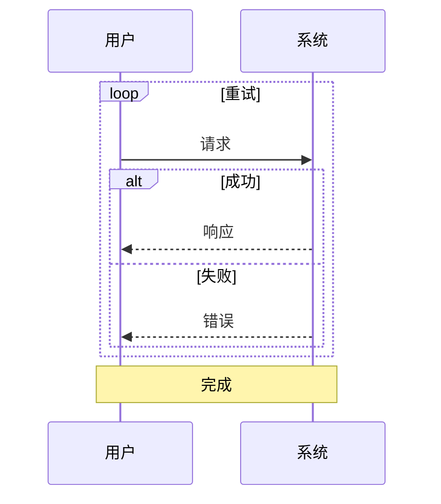
```mermaid
sequenceDiagram
participant A as 用户
participant B as 系统
loop 重试
A->>B: 请求
alt 成功
B-->>A: 响应
else 失败
B-->>A: 错误
end
end
Note over A,B: 完成
```

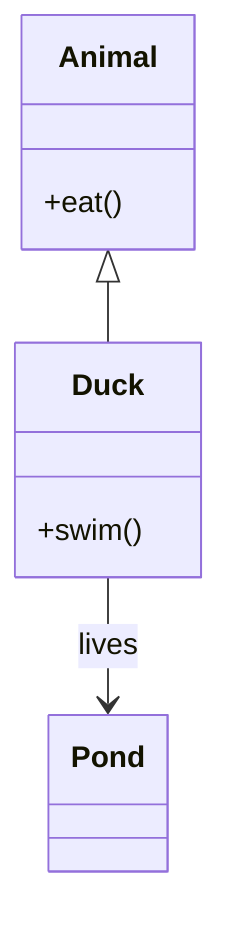
```mermaid
classDiagram
Animal <|-- Duck
Animal : +eat()
Duck : +swim()
Duck --> Pond : lives
```

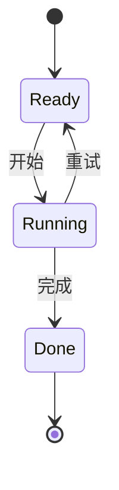
```mermaid
stateDiagram-v2
[*] --> Ready
Ready --> Running : 开始
Running --> Done : 完成
Running --> Ready : 重试
Done --> [*]
```

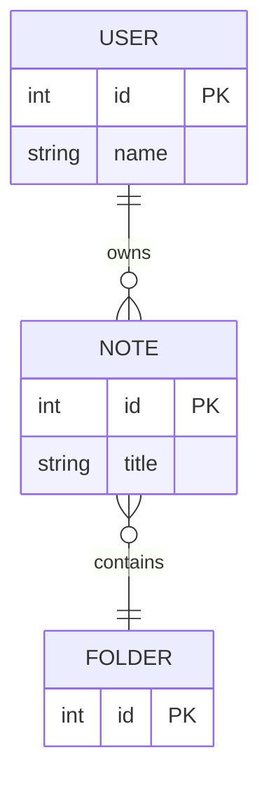
```mermaid
erDiagram
USER ||--o{ NOTE : owns
NOTE }o--|| FOLDER : contains
USER {
int id PK
string name
}
NOTE {
int id PK
string title
}
FOLDER {
int id PK
}
```

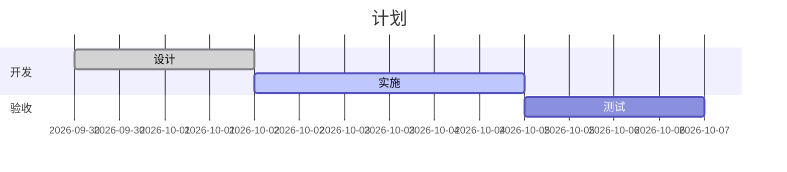
```mermaid
gantt
title 计划
dateFormat YYYY-MM-DD
section 开发
设计 :done, a1, 2026-09-30, 2d
实施 :active, a2, after a1, 3d
section 验收
测试 :a3, after a2, 2d
```

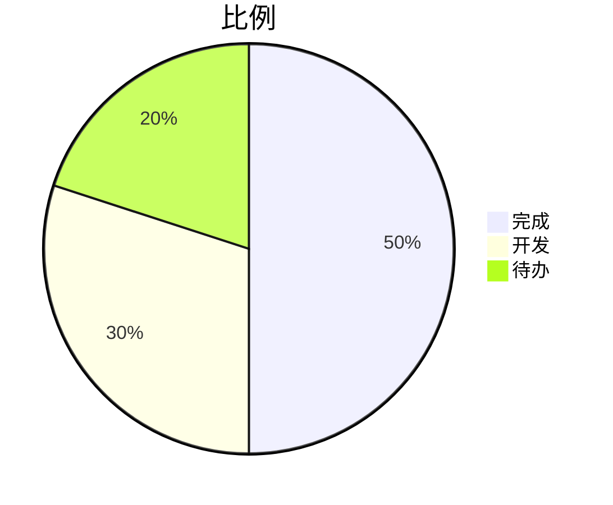
```mermaid
pie title 比例
"完成" : 50
"开发" : 30
"待办" : 20
```

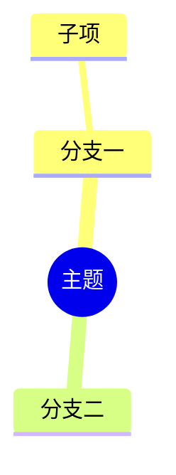
```mermaid
mindmap
  root((主题))
    分支一
      子项
    分支二
```

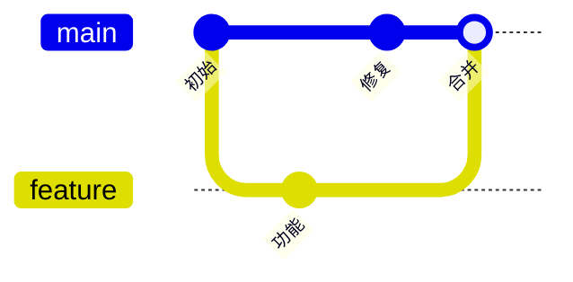
```mermaid
gitGraph
commit id: "初始"
branch feature
checkout feature
commit id: "功能"
checkout main
commit id: "修复"
merge feature id: "合并"
```

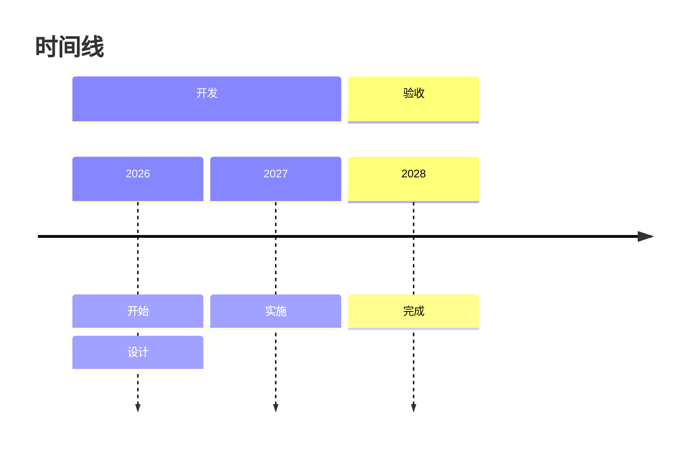
```mermaid
timeline
title 时间线
section 开发
2026 : 开始 : 设计
2027 : 实施
section 验收
2028 : 完成
```

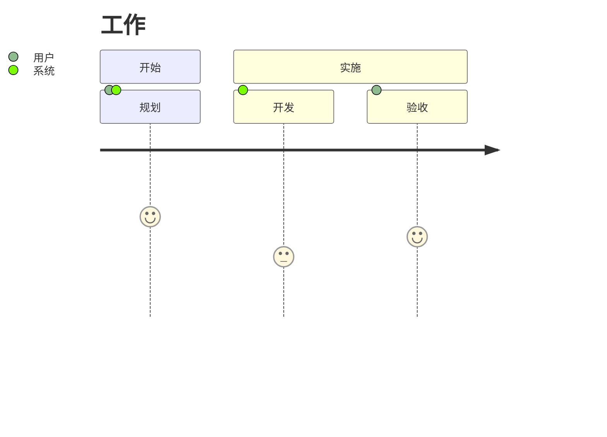
```mermaid
journey
title 工作
section 开始
规划: 5: 用户, 系统
section 实施
开发: 3: 系统
验收: 4: 用户
```
